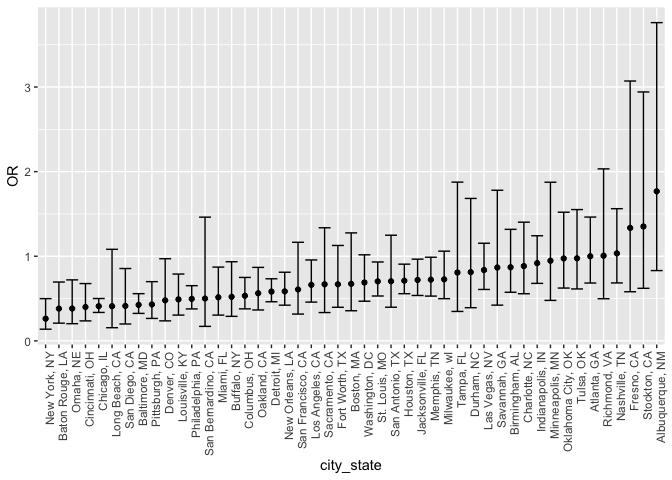
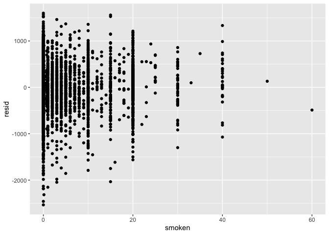
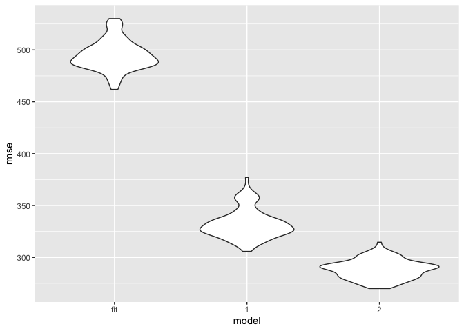
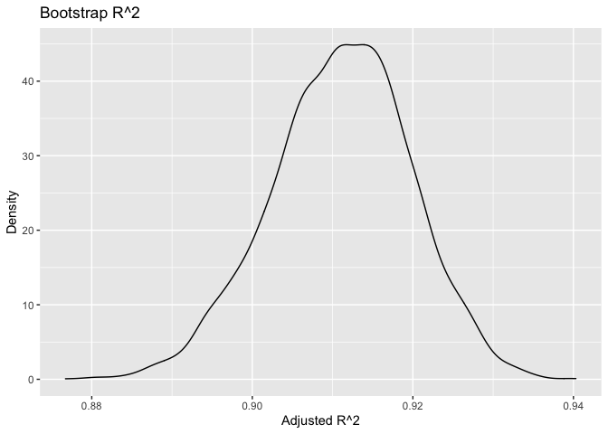
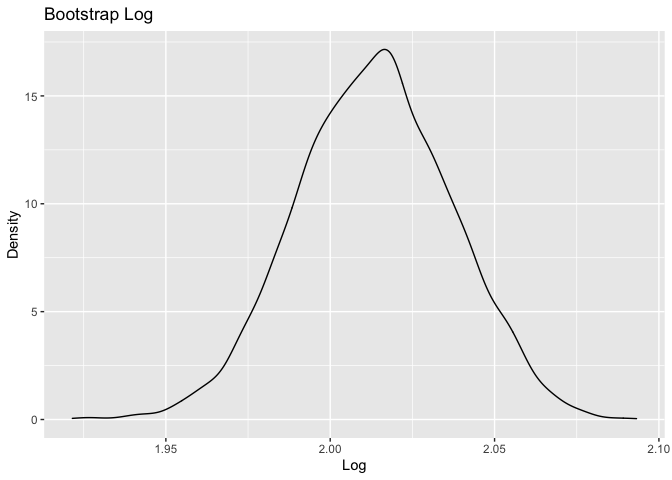

Homework 6
================

``` r
library(tidyverse)
```

    ## ── Attaching packages ───────────────────────────────────────────── tidyverse 1.3.0 ──

    ## ✓ ggplot2 3.3.2     ✓ purrr   0.3.4
    ## ✓ tibble  3.0.3     ✓ dplyr   1.0.2
    ## ✓ tidyr   1.1.2     ✓ stringr 1.4.0
    ## ✓ readr   1.3.1     ✓ forcats 0.5.0

    ## ── Conflicts ──────────────────────────────────────────────── tidyverse_conflicts() ──
    ## x dplyr::filter() masks stats::filter()
    ## x dplyr::lag()    masks stats::lag()

``` r
library(patchwork)
library(readxl)
library(broom)
library (modelr)
```

    ## 
    ## Attaching package: 'modelr'

    ## The following object is masked from 'package:broom':
    ## 
    ##     bootstrap

``` r
library(mgcv)
```

    ## Loading required package: nlme

    ## 
    ## Attaching package: 'nlme'

    ## The following object is masked from 'package:dplyr':
    ## 
    ##     collapse

    ## This is mgcv 1.8-33. For overview type 'help("mgcv-package")'.

``` r
set.seed(1)
```

## Problem 1

``` r
homicide_df = 

  read_csv("./data/homicide_data.csv")  %>%
 mutate(
    city_state = str_c(city, state, sep = ", "),
    victim_age = as.numeric(victim_age),
    resolution = case_when(
      disposition == "Closed without arrest" ~ 0,
      disposition == "Open/No arrest"        ~ 0,
      disposition == "Closed by arrest"      ~ 1)
  ) %>% 
  filter(
    victim_race %in% c("White", "Black"),
    city_state != "Tulsa, AL") %>% 
  select(city_state, resolution, victim_age, victim_race, victim_sex)
```

    ## Parsed with column specification:
    ## cols(
    ##   uid = col_character(),
    ##   reported_date = col_double(),
    ##   victim_last = col_character(),
    ##   victim_first = col_character(),
    ##   victim_race = col_character(),
    ##   victim_age = col_character(),
    ##   victim_sex = col_character(),
    ##   city = col_character(),
    ##   state = col_character(),
    ##   lat = col_double(),
    ##   lon = col_double(),
    ##   disposition = col_character()
    ## )

    ## Warning: Problem with `mutate()` input `victim_age`.
    ## ℹ NAs introduced by coercion
    ## ℹ Input `victim_age` is `as.numeric(victim_age)`.

    ## Warning in mask$eval_all_mutate(dots[[i]]): NAs introduced by coercion

``` r
baltimore_df =
  homicide_df %>% 
  filter(city_state == "Baltimore, MD")

glm(resolution ~ victim_age + victim_race + victim_sex, 
    data = baltimore_df,
    family = binomial()) %>% 
  broom::tidy() %>% 
  mutate(
    OR = exp(estimate),
    CI_lower = exp(estimate - 1.96 * std.error),
    CI_upper = exp(estimate + 1.96 * std.error)
  ) %>% 
  select(term, OR, starts_with("CI")) %>% 
  knitr::kable(digits = 3)
```

| term              |    OR | CI\_lower | CI\_upper |
| :---------------- | ----: | --------: | --------: |
| (Intercept)       | 1.363 |     0.975 |     1.907 |
| victim\_age       | 0.993 |     0.987 |     1.000 |
| victim\_raceWhite | 2.320 |     1.648 |     3.268 |
| victim\_sexMale   | 0.426 |     0.325 |     0.558 |

Try across cities

``` r
models_results_df = 
  homicide_df %>% 
  nest(data = -city_state) %>% 
  mutate(
    models = 
      map(.x = data, ~glm(resolution ~ victim_age + victim_race + victim_sex, data = .x, family = binomial())),
    results = map(models, broom::tidy)
  ) %>% 
  select(city_state, results) %>% 
  unnest(results) %>% 
  mutate(
    OR = exp(estimate),
    CI_lower = exp(estimate - 1.96 * std.error),
    CI_upper = exp(estimate + 1.96 * std.error)
  ) %>% 
  select(city_state, term, OR, starts_with("CI")) 
```

``` r
models_results_df %>% 
  filter(term == "victim_sexMale") %>% 
  mutate(city_state = fct_reorder(city_state, OR)) %>% 
  ggplot(aes(x = city_state, y = OR)) + 
  geom_point() + 
  geom_errorbar(aes(ymin = CI_lower, ymax = CI_upper)) + 
  theme(axis.text.x = element_text(angle = 90, hjust = 1))
```

<!-- -->

## Problem 2

Read and check class

``` r
baby_df = 
  read_csv("./data/birthweight.csv")
```

    ## Parsed with column specification:
    ## cols(
    ##   .default = col_double()
    ## )

    ## See spec(...) for full column specifications.

``` r
sapply(baby_df, class)
```

    ##   babysex     bhead   blength       bwt     delwt   fincome     frace   gaweeks 
    ## "numeric" "numeric" "numeric" "numeric" "numeric" "numeric" "numeric" "numeric" 
    ##   malform  menarche   mheight    momage     mrace    parity   pnumlbw   pnumsga 
    ## "numeric" "numeric" "numeric" "numeric" "numeric" "numeric" "numeric" "numeric" 
    ##     ppbmi      ppwt    smoken    wtgain 
    ## "numeric" "numeric" "numeric" "numeric"

All the variables are in numeric class and require no further
conversions or cleaning.

#### Proposed Model

``` r
model_fit = lm(bwt ~ smoken +mrace +momage + fincome, data = baby_df)
```

``` r
model_fit %>%  
    broom::tidy()%>% 
knitr::kable(digits=3)
```

| term        |  estimate | std.error | statistic | p.value |
| :---------- | --------: | --------: | --------: | ------: |
| (Intercept) |  3076.819 |    47.782 |    64.393 |       0 |
| smoken      |   \-8.686 |     1.032 |   \-8.415 |       0 |
| mrace       | \-127.569 |    10.492 |  \-12.159 |       0 |
| momage      |    10.398 |     2.058 |     5.052 |       0 |
| fincome     |     1.590 |     0.315 |     5.044 |       0 |

#### Plot of Modeled Residuals

``` r
baby_df %>% 
  modelr::add_residuals(model_fit) %>% 
  add_predictions(model_fit)%>% 
  ggplot(aes(x = pred, y = resid)) + 
  geom_point() +
  labs(title = "Residuals Against Fitted Values", x = "Fitted Values", y = "Residuals")
```

<!-- -->

``` r
model_one = lm(bwt ~ blength + gaweeks, data = baby_df)
model_two =  lm(bwt ~ bhead*blength + bhead*babysex +  blength*babysex + blength*babysex*bhead, data = baby_df)
```

``` r
model_one %>%  
    broom::tidy()%>% 
knitr::kable(digits=3)
```

| term        |   estimate | std.error | statistic | p.value |
| :---------- | ---------: | --------: | --------: | ------: |
| (Intercept) | \-4347.667 |    97.958 |  \-44.383 |       0 |
| blength     |    128.556 |     1.990 |    64.604 |       0 |
| gaweeks     |     27.047 |     1.718 |    15.744 |       0 |

``` r
model_two %>%  
    broom::tidy()%>% 
knitr::kable(digits=3)
```

| term                  |    estimate | std.error | statistic | p.value |
| :-------------------- | ----------: | --------: | --------: | ------: |
| (Intercept)           | \-13551.685 |  2759.413 |   \-4.911 |    0.00 |
| bhead                 |     380.189 |    83.395 |     4.559 |    0.00 |
| blength               |     225.900 |    57.398 |     3.936 |    0.00 |
| babysex               |    6374.868 |  1677.767 |     3.800 |    0.00 |
| bhead:blength         |     \-4.432 |     1.715 |   \-2.583 |    0.01 |
| bhead:babysex         |   \-198.393 |    51.092 |   \-3.883 |    0.00 |
| blength:babysex       |   \-123.773 |    35.119 |   \-3.524 |    0.00 |
| bhead:blength:babysex |       3.878 |     1.057 |     3.670 |    0.00 |

``` r
cv_df = 
   crossv_mc(baby_df, 100)%>% 
  mutate(
    train = map(train, as_tibble), 
    test = map(test, as_tibble)
  )
  cv_df = 
  cv_df %>% 
  mutate(
    model_fit  = map(train, ~lm(bwt ~ smoken +mrace +momage + fincome, data =.x)), 
    model_one= map(train, ~ lm(bwt ~ blength + gaweeks, data =.x)),
    model_two= map(train, ~ lm(bwt ~ bhead*blength + bhead*babysex +  blength*babysex + blength*babysex*bhead, data =.x))) %>%

   mutate(
    rmse_fit = map2_dbl(model_fit, test, ~rmse(model = .x, data = .y)),
    rmse_1    = map2_dbl(model_one, test, ~rmse(model = .x, data = .y)),
    rmse_2 = map2_dbl(model_two, test, ~rmse(model = .x, data = .y)))

cv_df %>% 
  select(starts_with("rmse")) %>% 
  pivot_longer(
    everything(),
    names_to = "model", 
    values_to = "rmse",
    names_prefix = "rmse_") %>% 
  mutate(model = fct_inorder(model)) %>% 
  ggplot(aes(x = model, y = rmse)) + geom_violin()
```

<!-- -->

Model 2 is the best given lower rmse

## Problem 3

``` r
weather_df = 
  rnoaa::meteo_pull_monitors(
    c("USW00094728"),
    var = c("PRCP", "TMIN", "TMAX"), 
    date_min = "2017-01-01",
    date_max = "2017-12-31") %>%
  mutate(
    name = recode(id, USW00094728 = "CentralPark_NY"),
    tmin = tmin / 10,
    tmax = tmax / 10) %>%
  select(name, id, everything())
```

    ## Registered S3 method overwritten by 'hoardr':
    ##   method           from
    ##   print.cache_info httr

    ## using cached file: /Users/julianponce/Library/Caches/R/noaa_ghcnd/USW00094728.dly

    ## date created (size, mb): 2020-10-02 22:02:43 (7.52)

    ## file min/max dates: 1869-01-01 / 2020-09-30

Drawing many bootstrap samples

``` r
boot_sample = function(df) {
  sample_frac(df, replace = TRUE)
}
```

``` r
boot_straps = 
  data_frame(
    strap_number = 1:5000,
    strap_sample = rerun(5000, boot_sample(weather_df))
  )
```

    ## Warning: `data_frame()` is deprecated as of tibble 1.1.0.
    ## Please use `tibble()` instead.
    ## This warning is displayed once every 8 hours.
    ## Call `lifecycle::last_warnings()` to see where this warning was generated.

``` r
boot_straps
```

    ## # A tibble: 5,000 x 2
    ##    strap_number strap_sample      
    ##           <int> <list>            
    ##  1            1 <tibble [365 × 6]>
    ##  2            2 <tibble [365 × 6]>
    ##  3            3 <tibble [365 × 6]>
    ##  4            4 <tibble [365 × 6]>
    ##  5            5 <tibble [365 × 6]>
    ##  6            6 <tibble [365 × 6]>
    ##  7            7 <tibble [365 × 6]>
    ##  8            8 <tibble [365 × 6]>
    ##  9            9 <tibble [365 × 6]>
    ## 10           10 <tibble [365 × 6]>
    ## # … with 4,990 more rows

``` r
bootstrap_results_r_sq = 
  boot_straps %>% 
  mutate(
    models = map(strap_sample, ~lm(tmax ~ tmin, data = .x) ),
    results = map(models, broom::glance)) %>% 
  select(-strap_sample, -models) %>% 
  unnest(results) 


bootstrap_results_r_sq %>% 
  ggplot(aes(x= adj.r.squared)) +
  geom_density() +
  labs(title = "Bootstrap R^2 ", x = "Adjusted R^2", y = "Density")
```

<!-- -->

This graph looks like it is normally distributed, the peak seems to be
at about .91.

Results 2

``` r
bootstrap_results_beta = 
  boot_straps %>% 
  mutate(
    models = map(.x = strap_sample, ~lm(tmax ~ tmin, data = .x) ),
    results = map(models, broom::tidy)) %>% 
  unnest(results) %>%
  select (strap_number, term, estimate)%>%
 mutate(
   term = str_replace(term,"\\(Intercept\\)","Intercept")) %>%
pivot_wider(
  names_from = "term", 
  values_from = "estimate")%>% 

mutate(
    log = log(Intercept * tmin)) 
```

``` r
bootstrap_results_beta%>% 
  ggplot(aes(x= log)) +
  geom_density()+
  labs(title = "Bootstrap Log ", x = "Log", y = "Density")
```

<!-- -->
