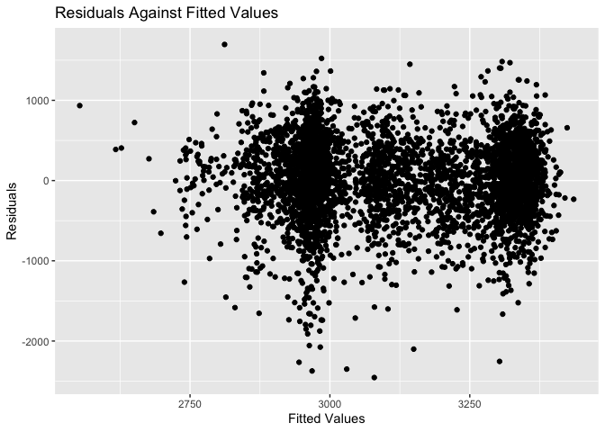
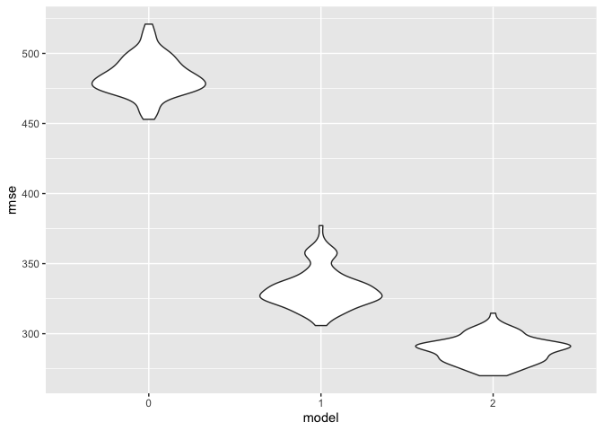

Homework 6
================

``` r
library(tidyverse)
```

    ## ── Attaching packages ───────────────── tidyverse 1.3.0 ──

    ## ✓ ggplot2 3.3.2     ✓ purrr   0.3.4
    ## ✓ tibble  3.0.3     ✓ dplyr   1.0.2
    ## ✓ tidyr   1.1.2     ✓ stringr 1.4.0
    ## ✓ readr   1.3.1     ✓ forcats 0.5.0

    ## ── Conflicts ──────────────────── tidyverse_conflicts() ──
    ## x dplyr::filter() masks stats::filter()
    ## x dplyr::lag()    masks stats::lag()

``` r
library(patchwork)
library(readxl)
library(broom)
library (modelr)
```

    ## 
    ## Attaching package: 'modelr'

    ## The following object is masked from 'package:broom':
    ## 
    ##     bootstrap

``` r
library(mgcv)
```

    ## Loading required package: nlme

    ## 
    ## Attaching package: 'nlme'

    ## The following object is masked from 'package:dplyr':
    ## 
    ##     collapse

    ## This is mgcv 1.8-33. For overview type 'help("mgcv-package")'.

``` r
set.seed(1)
```

## Problem 1

``` r
homicide_df = 

  read_csv("./data/homicide_data.csv")  %>%
 mutate(
    city_state = str_c(city, state, sep = ", "),
    victim_age = as.numeric(victim_age),
    resolution = case_when(
      disposition == "Closed without arrest" ~ 0,
      disposition == "Open/No arrest"        ~ 0,
      disposition == "Closed by arrest"      ~ 1)
  ) %>% 
  filter(
    victim_race %in% c("White", "Black"),
    city_state != "Tulsa, AL") %>% 
  select(city_state, resolution, victim_age, victim_race, victim_sex)
```

    ## Parsed with column specification:
    ## cols(
    ##   uid = col_character(),
    ##   reported_date = col_double(),
    ##   victim_last = col_character(),
    ##   victim_first = col_character(),
    ##   victim_race = col_character(),
    ##   victim_age = col_character(),
    ##   victim_sex = col_character(),
    ##   city = col_character(),
    ##   state = col_character(),
    ##   lat = col_double(),
    ##   lon = col_double(),
    ##   disposition = col_character()
    ## )

    ## Warning: Problem with `mutate()` input `victim_age`.
    ## ℹ NAs introduced by coercion
    ## ℹ Input `victim_age` is `as.numeric(victim_age)`.

    ## Warning in mask$eval_all_mutate(dots[[i]]): NAs introduced by coercion

``` r
baltimore_df =
  homicide_df %>% 
  filter(city_state == "Baltimore, MD")

glm(resolution ~ victim_age + victim_race + victim_sex, 
    data = baltimore_df,
    family = binomial()) %>% 
  broom::tidy() %>% 
  mutate(
    OR = exp(estimate),
    CI_lower = exp(estimate - 1.96 * std.error),
    CI_upper = exp(estimate + 1.96 * std.error)
  ) %>% 
  select(term, OR, starts_with("CI")) %>% 
  knitr::kable(digits = 3)
```

| term              |    OR | CI\_lower | CI\_upper |
| :---------------- | ----: | --------: | --------: |
| (Intercept)       | 1.363 |     0.975 |     1.907 |
| victim\_age       | 0.993 |     0.987 |     1.000 |
| victim\_raceWhite | 2.320 |     1.648 |     3.268 |
| victim\_sexMale   | 0.426 |     0.325 |     0.558 |

Try across cities

``` r
models_results_df = 
  homicide_df %>% 
  nest(data = -city_state) %>% 
  mutate(
    models = 
      map(.x = data, ~glm(resolution ~ victim_age + victim_race + victim_sex, data = .x, family = binomial())),
    results = map(models, broom::tidy)
  ) %>% 
  select(city_state, results) %>% 
  unnest(results) %>% 
  mutate(
    OR = exp(estimate),
    CI_lower = exp(estimate - 1.96 * std.error),
    CI_upper = exp(estimate + 1.96 * std.error)
  ) %>% 
  select(city_state, term, OR, starts_with("CI")) 
```

``` r
models_results_df %>% 
  filter(term == "victim_sexMale") %>% 
  mutate(city_state = fct_reorder(city_state, OR)) %>% 
  ggplot(aes(x = city_state, y = OR)) + 
  geom_point() + 
  geom_errorbar(aes(ymin = CI_lower, ymax = CI_upper)) + 
  theme(axis.text.x = element_text(angle = 90, hjust = 1))
```

<!-- -->

## Problem 2

Read and check class

``` r
baby_df = 
  read_csv("./data/birthweight.csv")
```

    ## Parsed with column specification:
    ## cols(
    ##   .default = col_double()
    ## )

    ## See spec(...) for full column specifications.

``` r
sapply(baby_df, class)
```

    ##   babysex     bhead   blength       bwt     delwt   fincome     frace   gaweeks 
    ## "numeric" "numeric" "numeric" "numeric" "numeric" "numeric" "numeric" "numeric" 
    ##   malform  menarche   mheight    momage     mrace    parity   pnumlbw   pnumsga 
    ## "numeric" "numeric" "numeric" "numeric" "numeric" "numeric" "numeric" "numeric" 
    ##     ppbmi      ppwt    smoken    wtgain 
    ## "numeric" "numeric" "numeric" "numeric"

``` r
baby_df =
  baby_df  %>%
mutate(
         babysex = as.factor(babysex),
         mrace = as.factor(mrace),
         frace = as.factor(frace),
         malform = as.factor(malform)
         )
```

I did not detect any missing data.

#### Proposed Model

The variables I chose for my model are average number of cigarettes
smoked per day during pregnancy (smoken), mother’s race (mrace),
mother’s age in years (momage),family’s monthly income (fincome). My
model was built based on the Zhang & Yang (2019) article “Maternal
Smoking and Infant Low Birth Weight: Exploring the Biological Mechanism
Through the Mother’s Pre-pregnancy Weight Status” as they found these to
be significant predictors on baby birthweight.

<https://link.springer.com/article/10.1007/s11113-019-09554-x>

``` r
model_0 = lm(bwt ~ smoken +mrace +momage + fincome, data = baby_df)
```

``` r
model_0 %>%  
    broom::tidy()%>% 
knitr::kable(digits=3)
```

| term        |  estimate | std.error | statistic | p.value |
| :---------- | --------: | --------: | --------: | ------: |
| (Intercept) |  3215.524 |    46.021 |    69.871 |   0.000 |
| smoken      |  \-11.099 |     1.022 |  \-10.862 |   0.000 |
| mrace2      | \-335.126 |    17.503 |  \-19.146 |   0.000 |
| mrace3      | \-193.349 |    74.982 |   \-2.579 |   0.010 |
| mrace4      | \-228.490 |    33.373 |   \-6.847 |   0.000 |
| momage      |     3.922 |     2.078 |     1.887 |   0.059 |
| fincome     |     0.620 |     0.315 |     1.968 |   0.049 |

#### Plot of Modeled Residuals

``` r
baby_df %>% 
  modelr::add_residuals(model_0) %>% 
  add_predictions(model_0)%>% 
  ggplot(aes(x = pred, y = resid)) + 
  geom_point() +
  labs(title = "Residuals Against Fitted Values", x = "Fitted Values", y = "Residuals")
```

<!-- -->

The plot of my model looks okay as most values seem to be close and
distributed near the x axis (0). I would be interested in further
exploring the values that are extreme on the negative axis.

``` r
model_one = lm(bwt ~ blength + gaweeks, data = baby_df)
model_two =  lm(bwt ~ bhead*blength + bhead*babysex +  blength*babysex + blength*babysex*bhead, data = baby_df)
```

``` r
model_one %>%  
    broom::tidy()%>% 
knitr::kable(digits=3)
```

| term        |   estimate | std.error | statistic | p.value |
| :---------- | ---------: | --------: | --------: | ------: |
| (Intercept) | \-4347.667 |    97.958 |  \-44.383 |       0 |
| blength     |    128.556 |     1.990 |    64.604 |       0 |
| gaweeks     |     27.047 |     1.718 |    15.744 |       0 |

``` r
model_two %>%  
    broom::tidy()%>% 
knitr::kable(digits=3)
```

| term                   |   estimate | std.error | statistic | p.value |
| :--------------------- | ---------: | --------: | --------: | ------: |
| (Intercept)            | \-7176.817 |  1264.840 |   \-5.674 |   0.000 |
| bhead                  |    181.796 |    38.054 |     4.777 |   0.000 |
| blength                |    102.127 |    26.212 |     3.896 |   0.000 |
| babysex2               |   6374.868 |  1677.767 |     3.800 |   0.000 |
| bhead:blength          |    \-0.554 |     0.780 |   \-0.710 |   0.478 |
| bhead:babysex2         |  \-198.393 |    51.092 |   \-3.883 |   0.000 |
| blength:babysex2       |  \-123.773 |    35.119 |   \-3.524 |   0.000 |
| bhead:blength:babysex2 |      3.878 |     1.057 |     3.670 |   0.000 |

``` r
cv_df = 
   crossv_mc(baby_df, 100)%>% 
  mutate(
    train = map(train, as_tibble), 
    test = map(test, as_tibble)
  )
  cv_df = 
  cv_df %>% 
  mutate(
    model_0  = map(train, ~lm(bwt ~ smoken +mrace +momage + fincome, data =.x)), 
    model_one= map(train, ~ lm(bwt ~ blength + gaweeks, data =.x)),
    model_two= map(train, ~ lm(bwt ~ bhead*blength + bhead*babysex +  blength*babysex + blength*babysex*bhead, data =.x))) %>%

   mutate(
    rmse_0 = map2_dbl(model_0, test, ~rmse(model = .x, data = .y)),
    rmse_1    = map2_dbl(model_one, test, ~rmse(model = .x, data = .y)),
    rmse_2 = map2_dbl(model_two, test, ~rmse(model = .x, data = .y)))

cv_df %>% 
  select(starts_with("rmse")) %>% 
  pivot_longer(
    everything(),
    names_to = "model", 
    values_to = "rmse",
    names_prefix = "rmse_") %>% 
  mutate(model = fct_inorder(model)) %>% 
  ggplot(aes(x = model, y = rmse)) + geom_violin()
```

<!-- -->

Model 2 is the best given it has the lowest rmse out of the three. Model
two is the one that included head circumfrence,sex, length, and their
interactions ( bhead x blength + bhead x babysex + blength x babysex +
blength x babysex x bhead)

My proposed model (0) actually has a very high rmse and thus is by far
the least optimal model.

## Problem 3

``` r
weather_df = 
  rnoaa::meteo_pull_monitors(
    c("USW00094728"),
    var = c("PRCP", "TMIN", "TMAX"), 
    date_min = "2017-01-01",
    date_max = "2017-12-31") %>%
  mutate(
    name = recode(id, USW00094728 = "CentralPark_NY"),
    tmin = tmin / 10,
    tmax = tmax / 10) %>%
  select(name, id, everything())
```

    ## Registered S3 method overwritten by 'hoardr':
    ##   method           from
    ##   print.cache_info httr

    ## using cached file: /Users/julianponce/Library/Caches/R/noaa_ghcnd/USW00094728.dly

    ## date created (size, mb): 2020-10-02 22:02:43 (7.52)

    ## file min/max dates: 1869-01-01 / 2020-09-30

Drawing many bootstrap samples

``` r
boot_sample = function(df) {
  sample_frac(df, replace = TRUE)
}
```

``` r
boot_straps = 
  data_frame(
    strap_number = 1:5000,
    strap_sample = rerun(5000, boot_sample(weather_df))
  )
```

    ## Warning: `data_frame()` is deprecated as of tibble 1.1.0.
    ## Please use `tibble()` instead.
    ## This warning is displayed once every 8 hours.
    ## Call `lifecycle::last_warnings()` to see where this warning was generated.

``` r
boot_straps
```

    ## # A tibble: 5,000 x 2
    ##    strap_number strap_sample      
    ##           <int> <list>            
    ##  1            1 <tibble [365 × 6]>
    ##  2            2 <tibble [365 × 6]>
    ##  3            3 <tibble [365 × 6]>
    ##  4            4 <tibble [365 × 6]>
    ##  5            5 <tibble [365 × 6]>
    ##  6            6 <tibble [365 × 6]>
    ##  7            7 <tibble [365 × 6]>
    ##  8            8 <tibble [365 × 6]>
    ##  9            9 <tibble [365 × 6]>
    ## 10           10 <tibble [365 × 6]>
    ## # … with 4,990 more rows

``` r
bootstrap_results_r_sq = 
  boot_straps %>% 
  mutate(
    models = map(strap_sample, ~lm(tmax ~ tmin, data = .x) ),
    results = map(models, broom::glance)) %>% 
  select(-strap_sample, -models) %>% 
  unnest(results) 


bootstrap_results_r_sq %>% 
  ggplot(aes(x= adj.r.squared)) +
  geom_density() +
  labs(title = "Bootstrap R^2 ", x = "Adjusted R^2", y = "Density")
```

<!-- -->

This plot of the adjusted r^2 looks like it is normally distributed, the
mean seems to be at about .91. The 95% CI (.89, .92) were calculated in
the next step.

``` r
 bootstrap_results_r_sq %>% 
summarise(
    ci_lower = quantile(adj.r.squared, 0.025),
    ci_upper = quantile(adj.r.squared, 0.975)) %>%
knitr::kable( )
```

| ci\_lower | ci\_upper |
| --------: | --------: |
| 0.8934048 | 0.9272809 |

Results 2

``` r
bootstrap_results_beta = 
  boot_straps %>% 
  mutate(
    models = map(.x = strap_sample, ~lm(tmax ~ tmin, data = .x) ),
    results = map(models, broom::tidy)) %>% 
  unnest(results) %>%
  select (strap_number, term, estimate)%>%
 mutate(
   term = str_replace(term,"\\(Intercept\\)","Intercept")) %>%
pivot_wider(
  names_from = "term", 
  values_from = "estimate")%>% 

mutate(
    log = log(Intercept * tmin)) 
```

``` r
 bootstrap_results_beta %>% 
 summarise(
    ci_lower = quantile(log, 0.025),
    ci_upper = quantile(log, 0.975)) %>%
knitr::kable( )
```

| ci\_lower | ci\_upper |
| --------: | --------: |
|  1.966942 |  2.058528 |

``` r
bootstrap_results_beta%>% 
  
  ggplot(aes(x= log)) +
  geom_density()+
  labs(title = "Bootstrap Log ", x = "Log", y = "Density")
```

<!-- -->

This plot of the log(B0 \*B1) looks like it is normally distributed, the
mean seems to be at about 2.20. The 95% CI (1.97,2.06) were calculated
in the next step.
